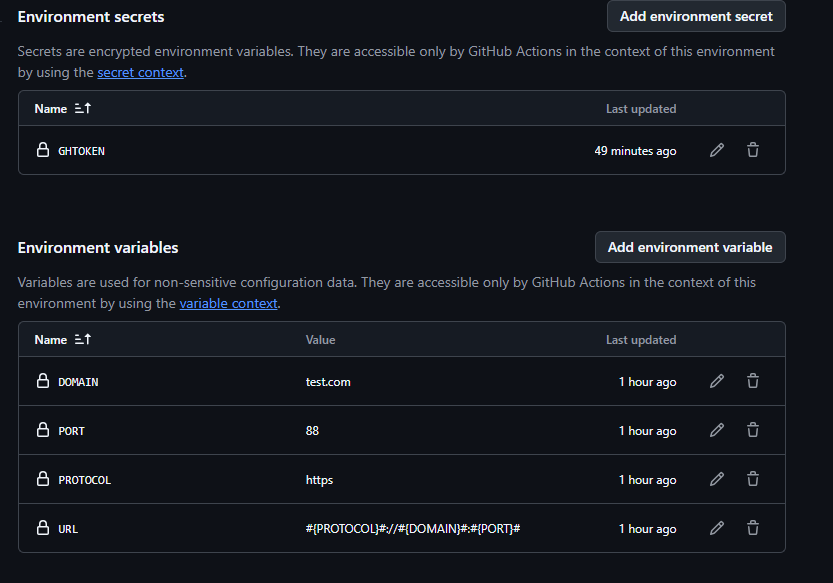

# Replace tokens nested

Simple GitHub Action to replace tokens in files. The token values can be from
either token value files or from environment variables. Additional support for
nested tokens like a token's value can refer to a few sub tokens. one example
and URL token's value can be like: #{PROTOCOL}#://#{DOMAIN}#:#{PORT}# where
"PROTOCOL", "DOMAIN" and "PORT" are three other tokens.

## Inputs

- `files` - Glob expression, file name or array of glob/file name
- `tokenPrefix` - Prefix to use when matching tokens, defaults to `#{`
- `tokenSuffix` - Suffix to use when matching tokens, defaults to `}#`
- `tokenValueFiles` - Token value file(s) - if not specified, token values will
  be read from environment variables, defaults to `[]`
- `environment` - Environment name. Only needed when you want to load token from
  environment variables, defaults to ``
- `repo-token` - Optional GitHub token, if environment is supplied, this token
  will be used to access variables

## Outputs

- `changedFiles` - A list of file names that have been changed

## Example

### If you want to replace tokens in all of your txt files from token value files, add the action to your workflow like this:

```yml
- uses: Zeechen/nested-token-replace@v1
  with:
    files: test-files/*.txt
    tokenValueFiles: test-files/test.tkconf
```

one example of token value file is like:

```json
[
  {
    "key": "token1",
    "value": "1"
  },
  {
    "key": "token2",
    "value": "2"
  }
]
```

### The token key value pairs can also be read from variables for an environment in github, add the action to your workflow like this:

```yml
- uses: Zeechen/nested-token-replace@v1
  with:
    files: test-files/*.txt
    environment: TEST
    repo-token: ${{ secrets.GHTOKEN }}
```

and the variables will be added to this environment like below:


### If you want to use a different token format, you can specify a custom token prefix/suffix. For example you could add:

```yml
- uses: Zeechen/nested-token-replace@v1
  with:
    tokenPrefix: '{'
    tokenSuffix: '}'
    files: '["**/*.js"]'
    tokenValueFiles: test-files/test.tkconf
```

# Acknowledgements

- Extended based on the wonderful
  https://github.com/marketplace/actions/replace-tokens by cschleiden.
- Inspired by https://github.com/marketplace/actions/replace-token for the
  evironment varibles part.
- Uses [replace-in-file](https://github.com/adamreisnz/replace-in-file) to do
  the actual replacement
